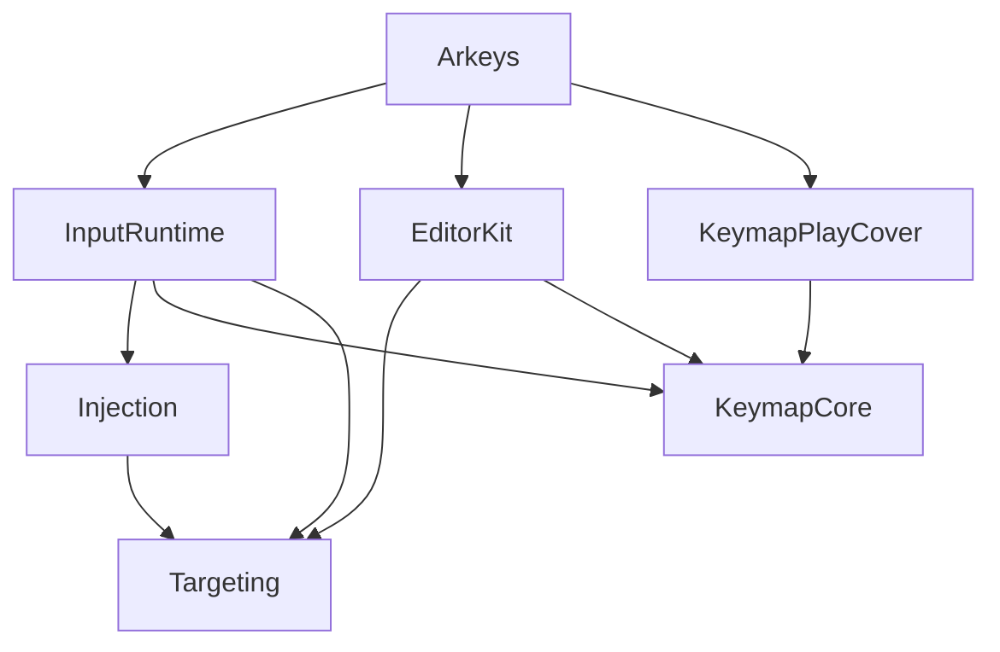

- [Code Of Conduct](#code-of-conduct)
  - [Package Layout](#package-layout)
  - [Unified Data Model](#unified-data-model)
  - [Third-Party Formats](#third-party-formats)
  - [Swift, AppKit Conventions](#swift-appkit-conventions)
  - [Testing](#testing)

# Code Of Conduct

Arkeys consists of several local Swift packages plus a thin AppKit host application. New code must go into the appropriate package. Do not cross layer boundaries to modify other packages merely for convenience when writing tests or for short-term expediency.

- Windows, menus, and whether the app appears in the Dock are handled by AppKit.
- UI content may use SwiftUI.
- All UI and window-position calculations must run on the main thread; annotate the relevant types with `@MainActor`.
- When system notifications or Accessibility callbacks return to the main thread, continue using the existing patterns: `MainActor.assumeIsolated` or `Task { @MainActor in … }`.

## Package Layout

```text
Arkeys/                 Host app: menu bar, settings, click hints, editing sessions
Packages/
  KeymapCore            Unified key-mapping model, settings storage, scheme registration (Foundation only)
  KeymapPlayCover       PlayCover plist / playmap format conversion
  Targeting             Window geometry, Accessibility geometry, running applications
  Injection             Sending clicks and keystrokes via CGEvent / SkyLight / HID
  InputRuntime          Foreground-app detection, key dispatch, scheme persistence
  EditorKit             Editing overlays and key-label overlays
```

Dependencies may only point downward; they must never point upward. The host application is responsible for wiring the packages together.



- KeymapCore depends solely on Foundation. Do not introduce AppKit or SwiftUI here, and do not place mouse-pointer calculations, resize-handle geometry, or raw structures from third-party files in this package.
- KeymapPlayCover (and future format-conversion packages of the same kind) may depend only on KeymapCore. Do not place UI, event sending, or Targeting code here.
- Targeting may use AppKit and Accessibility APIs. Do not store key-mapping data or editing UI here.
- Injection may use Targeting. Do not place key-mapping editing or SwiftUI here.
- InputRuntime may compose KeymapCore, Injection, and Targeting. Do not place overlay UI here.
- EditorKit may use KeymapCore and Targeting. Do not parse or write third-party formats, and do not send clicks.

The host application is responsible for assembling these packages. Settings, the menu bar, and editing sessions all live in `Arkeys/`; they must not be placed in EditorKit or KeymapCore.

## Unified Data Model

Both in-memory and on-disk key maps are authoritative in the form of `CanonicalKeymap`.

- Positions are relative to the target window, origin at the top-left, range `0…1`.
- `NormalizedTransform.size` stores ratios. When creating objects or decoding from files, clamp sizes to the legal range. If a decoded value is greater than `1`, treat it as a percentage (e.g., read `5` as `0.05`).
- `visualScale` converts the stored size into UI scale; `1` represents the default keycap size.
- Display-only constraints such as scale lower/upper bounds and pixel side lengths belong in EditorKit’s editing-bar code; they must not live in KeymapCore.

## Third-Party Formats

- Each third-party format implements its own `KeymapSchemeParser` and lives in its own package.
- Conversion occurs at the file-read and file-write boundaries; do not perform a second conversion while drawing the UI.
- On import, transform the foreign data structure into a `CanonicalKeymap`, normalize sizes, and map key codes.
- On export, transform from `CanonicalKeymap` back into the foreign data structure.

## Swift, AppKit Conventions

- Keep a single write path for any given mutation. Do not retain multiple near-identical entry points such as `bindKey`, `updateButton`, and `upsertButton`.
- Remove unused parameters—for example a `dimmed` flag that is always `false`, or a `handleInset` that is always `0`. If `style` already encodes selection state, do not pass an extra `selected` argument.
- The application runs by default as a menu-bar accessory with activation policy `NSApplication.ActivationPolicy.accessory`.
- Prefer system notifications or Accessibility observations over polling with timers. Using a `Timer` that tracks a window is acceptable only as a fallback, never as the default approach for new features.

## Testing

Place tests in the package that owns the behavior under test. Rules that do not depend on windows should be expressed as pure functions and tested as such.

Use the full Xcode toolchain; do not rely solely on the Command Line Tools:

```bash
export DEVELOPER_DIR=/Applications/Xcode.app/Contents/Developer
swift test --package-path Packages/KeymapCore
swift test --package-path Packages/EditorKit
```
